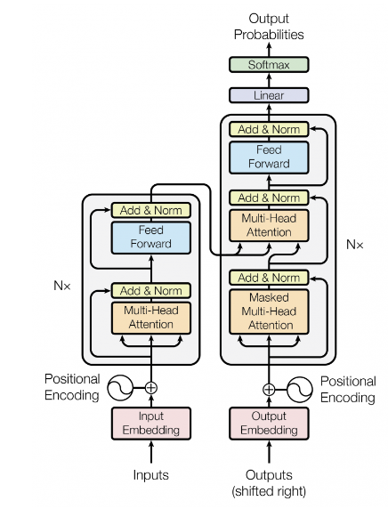

# Transformer from Scratch

## Overview
The Transformer is a powerful neural network architecture that has been shown to achieve state-of-the-art performance on a wide range of natural language processing tasks, including language modeling, machine translation, and sentiment analysis.

## The Embedding Layer
The embedding layer provides each token in a corpus with a corresponding vector representation. This is the first layer that each sequence must be passed through. Each token in each sequence has to be embedded in a vector with a length of d_model. The input into this layer is (batch_size, seq_length). The output is (batch_size, seq_length, d_model).

## Positional Encoding

These embedded sequences are then positionally encoded to provide additional context to each word. This also allows for a single word to have varying meanings depending on its placement in the sentence. The input to the layer is (batch_size, seq_length, d_model). The positional encoding matrix, with a size of (max_length, d_model), must be sliced to the same length as each sequence in the batch, giving it a size of (seq_length, d_model). This same matrix is broadcast and added to each sequence in the batch to ensure consistency. The final output is (batch_size, seq_length, d_model).

## Multi-Head Attention

In the multi-head attention mechanism, three identical versions of encoded sequences create query, key, and value tensors of size (batch_size, seq_length, d_model). These are split into n_heads, each with size (batch_size, n_heads, seq_length, d_key), allowing multiple sub-representations for each sequence. The query and key tensors are multiplied (after transposing the key) to generate attention scores, which are scaled by √(d_key) and masked as needed. These scores weight the values tensor, yielding a context-rich output (batch_size, n_heads, Q_length, d_key). The heads are concatenated to restore shape (batch_size, seq_length, d_model), passed through a final linear layer, and output as (batch_size, seq_length, d_model).

## Position-Wise Feed-Forward Network

After being passed through layer normalization and undergoing residual addition, the output from the attention mechanism is passed to the FFN. The FFN consists of two linear layers with a ReLU activation function. The first layer has a shape of (d_model, d_ffn). This is broadcast across each sequence of the (batch_size, seq_length, d_model) tensor, and it allows the model to learn more about each sequence. The tensor has a shape of (batch_size, seq_length, d_ffn) at this point, and it is passed through ReLU. Then, it is passed through the second layer, which has a shape of (d_ffn, d_model). This contracts the tensor to its original size, (batch_size, seq_length, d_model). The outputs are passed through layer normalization and undergo residual addition.

## Layer Normalization

These stand for layer normalization and residual connection.These are optimization tricks which help us in better training the model. LayerNormalization Idea is to cut down on uninformative variation in hidden vector values by normalizing to unit mean and standard deviation within each layer. LayerNorm’s success may be due to its normalizing gradients Residual Connection help to make the loss profile more smooth as we use the input of the layer and add the residual and gradient calculation

## The Encoder

Each encoder layer includes all of the aforementioned layers. It is responsible for enriching the embeddings of the source sequences. The input has a size of (batch_size, seq_length, d_model). The embedded sequences are passed directly to the multi-head attention mechanism. After being passed through Nx layers in the Encoder stack, the output is an enriched representation of each sequence that contains as much context as possible. It has a size of (batch_size, seq_length, d_model).

## The Decoder

Each decoder layer has two responsibilities: (1) to learn the autoregressive representation of the shifted target sequence and (2) to learn how the target sequence relates to the enriched embeddings from the Encoder. Like the Encoder, a Decoder stack has Nx decoder layers. As mentioned before, the Encoder output is passed to each decoder layer.

The input to the first decoder layer is shifted right, and it is embedded and encoded. It has a shape of (batch_size, seq_length, d_model). It is passed through the first attention mechanism, where the model learns an autoregressive representation of the sequence with itself. The output of this mechanism retains its shape, and it is passed to the second attention mechanism. It is multiplied against the encoder’s enriched embeddings, and the output once again retains its original shape.

After being passed through the FFN, the tensor is passed through a final linear layer that has a shape of (d_model, vocab_size). This creates a tensor with a size of (batch_size, seq_length, vocab_size). These are the logits for the sequence. These logits can be passed through a softmax function, and the highest probability is the prediction for each token.

## Transformer
The Encoder and Decoder can be combined in a module to create the Transformer model. The module can be initialized with an Encoder, Decoder, and the target and source embeddings.

The forward pass requires the source sequences and shifted target sequences. The sources are embedded and passed through the Encoder. The output and embedded target sequences are passed through the Decoder. The functions to create the source and target masks are also part of the module.

The logits are the output of the model. The tensor has a size of (batch_size, seq_length, vocab_size). Encoder, Decoder, positional encodings, and embeddings. Then, it passes these into the Transformer module to create a model that can be trained. In the last article, these steps were performed on their own, which is an acceptable alternative.